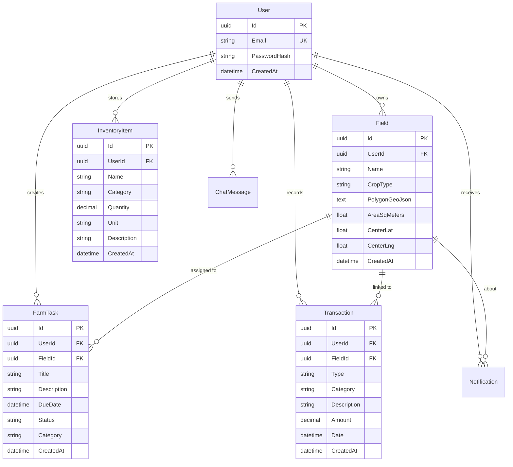

# 🌾 Bereket — Akıllı Tarım Yönetim Platformu

<div align="center">

**Tarladan sofraya, veriden karara — çiftçinin dijital ortağı.**

[](https://nextjs.org/)
[](https://dotnet.microsoft.com/)
[](https://postgresql.org/)
[](#license)

</div>

---

## 📖 Proje Hakkında

**Bereket**, küçük ve orta ölçekli çiftçilerin tarla yönetimi, hava durumu takibi, finansal planlama, envanter kontrolü ve yapay zeka destekli danışmanlık ihtiyaçlarını **tek bir platformda** karşılayan uçtan uca bir **Tarım Yönetim Sistemi (FMS)** ve **Kurumsal Kaynak Planlama (ERP)** çözümüdür.

### ✨ Neden Bereket?

| Özellik | Geleneksel Yöntem | Bereket |
|---------|-------------------|---------|
| Tarla Takibi | Kağıt/defter | Haritada poligon çizim + uydu entegrasyonu |
| Hava Durumu | TV/internet'ten manuel bakma | Tarlaya özel 7 günlük tahmin + toprak nemi |
| Finansal Yönetim | Excel tablosu | Gelir/gider takibi + otomatik ROI analizi |
| Danışmanlık | Ziraat odası ziyareti | 7/24 yapay zeka destekli RAG danışman |
| Stok Takibi | Hafızaya güvenme | Dijital depo yönetimi + azalan stok uyarısı |

---

## 🏗️ Mimari

```
┌─────────────────────────────────────────────────┐
│                   FRONTEND                       │
│            Next.js 15 (App Router)               │
│     React 19 · TypeScript · Tailwind CSS         │
│                                                  │
│  ┌──────┐ ┌──────┐ ┌──────┐ ┌──────┐ ┌───────┐  │
│  │Tarla │ │ Hava │ │Finans│ │ Depo │ │Danışmn│  │
│  │Modülü│ │Modülü│ │Modülü│ │Modülü│ │(AI)   │  │
│  └──┬───┘ └──┬───┘ └──┬───┘ └──┬───┘ └──┬────┘  │
│     │        │        │        │        │        │
└─────┼────────┼────────┼────────┼────────┼────────┘
      │        │        │        │        │
      ▼        ▼        ▼        ▼        ▼
┌─────────────────────────────────────────────────┐
│                   BACKEND                        │
│           ASP.NET Core 8 Web API                 │
│         Clean Architecture · JWT Auth            │
│                                                  │
│  Controllers → Services → Repositories → EF Core │
└─────────────────────┬───────────────────────────┘
                      │
                      ▼
┌─────────────────────────────────────────────────┐
│               PostgreSQL 16                      │
│   Users · Fields · Tasks · Transactions ·        │
│   InventoryItems · ChatMessages · Notifications  │
└─────────────────────────────────────────────────┘
```

### Harici API Entegrasyonları

| Servis | Amaç | Tür |
|--------|-------|-----|
| [Open-Meteo](https://open-meteo.com/) | 7 günlük hava tahmini, toprak nemi, UV indeksi | Ücretsiz, API key gerektirmez |
| [OpenStreetMap / Leaflet](https://leafletjs.com/) | Harita görüntüleme ve poligon çizim | Ücretsiz |
| [Nominatim](https://nominatim.openstreetmap.org/) | Koordinattan adres çözümleme (Reverse Geocoding) | Ücretsiz |

---

## 🚀 Özellikler

### 🔐 Kimlik Doğrulama
- E-posta + şifre ile kayıt ve giriş
- JWT tabanlı güvenli oturum yönetimi
- Yetkisiz erişim engelleme (401 koruması)

### 🌾 Tarla Yönetimi
- Haritada poligon çizerek tarla tanımlama
- Otomatik alan (m²/dönüm) hesaplama
- Ürün türü (Buğday, Kayısı, Pamuk vb.) atama
- Tarla listeleme, detay görüntüleme ve silme

### 🌤️ Hava Durumu
- Tarlaya özel konum bazlı 7 günlük hava tahmini
- Sıcaklık, rüzgar, yağış, UV indeksi, gün doğumu/batımı
- **Toprak nemi** ve **toprak sıcaklığı** verileri (IoT simülasyonu)
- Saatlik detaylı hava grafiği

### 📋 Görev Yönetimi
- Sulama, gübreleme, ilaçlama, hasat gibi operasyonları planlama
- Tarih ve tarla bazlı görev atama
- Statü takibi (Bekliyor / Devam Ediyor / Tamamlandı)

### 💰 Finansal Yönetim
- Gelir ve gider kaydı oluşturma
- Kategori bazlı sınıflandırma (Gübre, İşçilik, Yakıt, Satış vb.)
- Tarla bazlı maliyet takibi
- İşlem silme desteği

### 📦 Depo & Envanter
- Gübre, ilaç, tohum, yakıt stok takibi
- Birim bazlı kayıt (Kg, Litre, Adet, Çuval)
- **Akıllı stok uyarıları:** Azalan stok sarı, tükenen stok kırmızı etiket

### 🧠 Yapay Zeka Danışman (RAG Mimarisi)
Bereket'in en güçlü ve fark yaratan özelliği. Basit bir chatbot değil, **RAG (Retrieval-Augmented Generation)** mimarisine sahip tarımsal zeka motoru:

- **GDD (Growing Degree Days):** Isı birikimi hesaplayarak bitkinin fenolojik evresini tahmin eder
- **ROI (Yatırım Getirisi):** Tarla alanı, rekolte tahmini ve piyasa fiyatlarıyla net kâr hesaplar
- **Zararlı Uyanış Modeli:** Üst üste sıcak günleri analiz ederek böcek popülasyonu patlaması riskini hesaplar
- **Hastalık & İlaçlama Analizi:** Rüzgar hızı ve sıcaklık bandına göre ilaçlama uygunluğu ve fungal risk değerlendirmesi
- **Sulama Tavsiyesi:** FAO ET₀ (evapotranspirasyon) formülüyle su stresini hesaplar

---

## 🛠️ Teknoloji Stack

### Frontend
| Teknoloji | Versiyon | Kullanım |
|-----------|----------|----------|
| Next.js | 15 | App Router, SSR/CSR |
| React | 19 | UI bileşenleri |
| TypeScript | 5 | Tip güvenliği |
| Tailwind CSS | 4 | Stil sistemi |
| Leaflet | 1.9 | Harita ve poligon çizim |

### Backend
| Teknoloji | Versiyon | Kullanım |
|-----------|----------|----------|
| ASP.NET Core | 8.0 | Web API |
| Entity Framework Core | 8.0 | ORM |
| Npgsql | - | PostgreSQL sürücüsü |
| BCrypt.Net | - | Şifre hashleme |
| JWT Bearer | - | Kimlik doğrulama |

### Altyapı
| Teknoloji | Kullanım |
|-----------|----------|
| PostgreSQL 16 | Ana veritabanı |
| Docker | Veritabanı konteynerizasyonu |

---

## ⚡ Kurulum

### Gereksinimler
- [Node.js](https://nodejs.org/) v18+
- [.NET 8 SDK](https://dotnet.microsoft.com/download)
- [Docker Desktop](https://www.docker.com/products/docker-desktop/)
- [Git](https://git-scm.com/)

### 1. Projeyi Klonlayın
```bash
git clone https://github.com/HsynSrky/Bereket.git
cd Bereket
```

### 2. PostgreSQL Veritabanını Başlatın
```bash
docker run -d \
  --name bereket-postgres \
  -e POSTGRES_USER=postgres \
  -e POSTGRES_PASSWORD=postgres \
  -e POSTGRES_DB=agrios \
  -p 5432:5432 \
  postgres:16-alpine
```

### 3. Backend'i Çalıştırın
```bash
cd backend/AgriOS.Api

# Veritabanı migration'ları uygulayın
dotnet ef database update -p ../AgriOS.Infrastructure -s .

# API'yi başlatın
dotnet run
```
Backend `http://localhost:5117` adresinde çalışacaktır.

### 4. Frontend'i Çalıştırın
```bash
cd frontend

# Bağımlılıkları yükleyin
npm install

# Geliştirme sunucusunu başlatın
npm run dev
```
Frontend `http://localhost:3000` adresinde çalışacaktır.

---

## 📁 Proje Yapısı

```
Bereket/
├── backend/
│   ├── AgriOS.Api/                 # Controllers, Program.cs, Middleware
│   │   └── Controllers/
│   │       ├── AuthController.cs
│   │       ├── FieldsController.cs
│   │       ├── TasksController.cs
│   │       ├── FinancesController.cs
│   │       └── InventoryController.cs
│   ├── AgriOS.Application/        # Services, DTOs, Interfaces
│   ├── AgriOS.Domain/             # Entity modelleri
│   │   └── Entities/
│   │       ├── User.cs
│   │       ├── Field.cs
│   │       ├── FarmTask.cs
│   │       ├── Transaction.cs
│   │       ├── InventoryItem.cs
│   │       ├── ChatMessage.cs
│   │       └── Notification.cs
│   └── AgriOS.Infrastructure/     # EF Core, DbContext, Migrations
│
├── frontend/
│   ├── app/
│   │   ├── (dashboard)/           # Korumalı sayfalar (auth gerekli)
│   │   │   ├── dashboard/         # Ana kontrol paneli
│   │   │   ├── fields/            # Tarla yönetimi + [id] detay
│   │   │   ├── weather/           # Hava durumu
│   │   │   ├── tasks/             # Görev yönetimi
│   │   │   ├── finances/          # Gelir/gider takibi
│   │   │   ├── inventory/         # Depo/envanter
│   │   │   └── advisor/           # AI danışman
│   │   ├── login/                 # Giriş sayfası
│   │   └── register/              # Kayıt sayfası
│   ├── components/
│   │   └── layout/
│   │       └── AppShell.tsx        # Ana layout (sidebar + header)
│   └── lib/
│       ├── api/                   # API istemcileri
│       │   ├── client.ts          # Base HTTP client
│       │   ├── fields.ts
│       │   ├── weather.ts
│       │   ├── tasks.ts
│       │   ├── finances.ts
│       │   ├── inventory.ts
│       │   └── advisor.ts         # RAG AI motoru
│       └── auth.ts                # Token yönetimi
│
├── docker-compose.yml
└── README.md
```

---

## 🗄️ Veritabanı Şeması (ERD)



---

## 🧪 Test Sonuçları

Son E2E test sonucu: **25/25 (%100 başarı)**

| Modül | Test Sayısı | Sonuç |
|-------|-------------|-------|
| 🔐 Auth (Kimlik Doğrulama) | 3 | ✅ %100 |
| 🌾 Fields (Tarla Yönetimi) | 3 | ✅ %100 |
| 🌤️ Weather (Hava Durumu) | 1 | ✅ %100 |
| 📋 Tasks (Görev Yönetimi) | 2 | ✅ %100 |
| 💰 Finances (Finans) | 4 | ✅ %100 |
| 📦 Inventory (Depo) | 3 | ✅ %100 |
| 🖥️ Frontend (Sayfa Yükleme) | 9 | ✅ %100 |

---

## 🗺️ Yol Haritası

- [x] Kullanıcı kayıt/giriş (JWT)
- [x] Haritada tarla çizme ve yönetimi
- [x] Konum bazlı hava durumu entegrasyonu
- [x] Yapay zeka danışman (RAG mimarisi)
- [x] Görev yönetimi modülü
- [x] Gelir/gider takibi
- [x] Depo ve envanter yönetimi
- [x] GDD, ROI, Zararlı Uyanış algoritmaları
- [ ] Flutter mobil uygulama
- [ ] Uydu görüntüsü / NDVI analizi
- [ ] Fotoğraftan hastalık tespiti (Vision AI)
- [ ] IoT sensör entegrasyonu
- [ ] Canlı borsa fiyatları entegrasyonu
- [ ] Push bildirimler

---

## 👥 Katkıda Bulunma

1. Bu repo'yu fork edin
2. Feature branch oluşturun (`git checkout -b feature/yeni-ozellik`)
3. Değişikliklerinizi commit edin (`git commit -m 'feat: yeni özellik eklendi'`)
4. Branch'inizi push edin (`git push origin feature/yeni-ozellik`)
5. Pull Request açın

---

## 📄 Lisans

Bu proje [MIT Lisansı](LICENSE) ile lisanslanmıştır.

---

<div align="center">

**Bereket** ile toprağınızın gücünü keşfedin. 🌾

*Tarım teknolojisinin geleceği burada başlıyor.*

</div>
